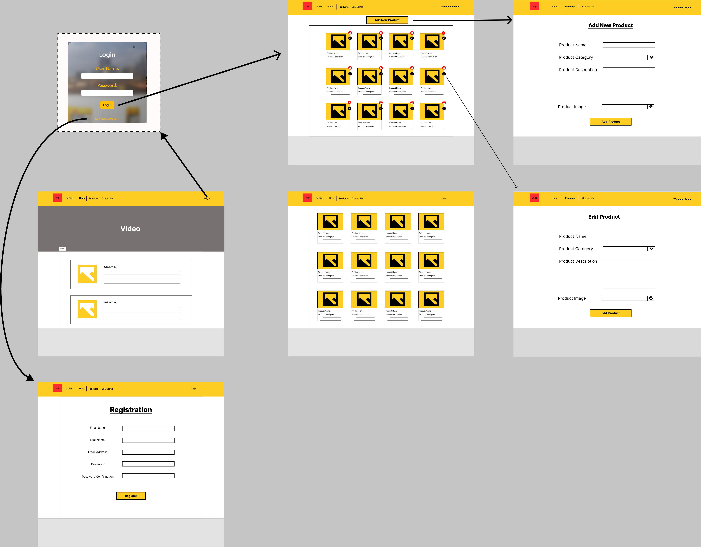

# PalSika
Project Proposal: PalSika

## Abstract
This project aims to create a website for PalSika company which focuses on marketing and distributing Sika’s construction material products at the West-Bank, Palestine. The project will provide PalSika with a website that focuses on delivering two main points, helping PalSika to manage and present their products, and allow the customer to reach to PalSika available products and find all the required information about them before they make an order.

Requirements
-	Main page will present two articles (recent products added to the site).
-	Navigation bar at the top to help in navigating between multiple pages.
-	Login window for PalSika employees which gives them authorities to manage products.
-	Registration page to add new PalSika employees accounts to the system.
-	Product page (Clients) will display all the products available at PalSika system.
-	Product page (Admin) will display all the products available at PalSika system, a delete and edit button for each product, and a “Add New Product” button.
-	 Edit page (Admin) will display the related information of the selected product to be edited.

## Wireframe

For Full Resolution

## Future Work
### Add new Features
-	When creating a new user there will be two types (Normal User / Admin User).
-	Adding a search bar on the products page.
-	Adding a filter drop-down menu to show products according to their categories.
-	Adding “**About us**” page.
-	Adding a “**Cart System**” for normal users to contain all their orders.
-	Adding a “**Product Details**” Page for each product to let the users find out more about each product.
-	Adding an “**Add to cart**” option on the “**Product Details**” Page that will allow the user to add that product + the required quantity to the cart.
-	Add “**Submit Order**” from the “**Cart**” to send the created order and the user’s contact information.
-	Add “**Orders Page**” for the Admin navigation bar, which contains a record of all the orders submitted from the users.
-	Admins can change the status of the orders (default (when submitted) = **pending review / accepted / partially accepted/rejected**).
-	Admins can archive the orders which will remove the archived order from the orders page.
-	Add “**Archived Tap**” Page inside the “**Orders Page**” which will display all records of the archived orders **(read-only)** with no delete or edit. 

